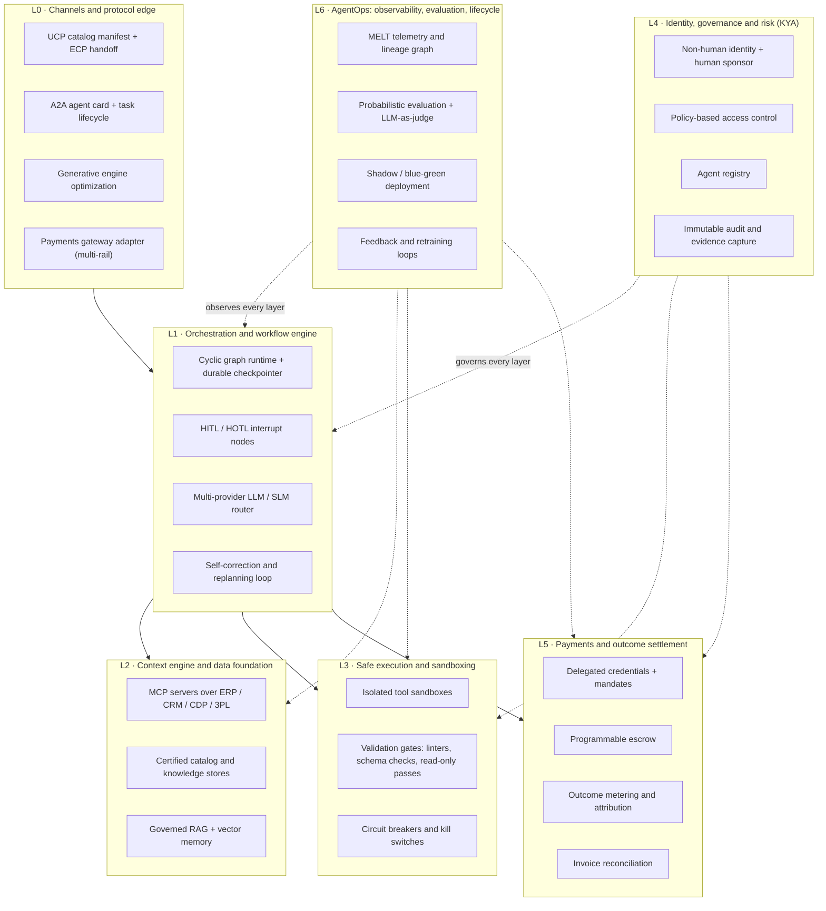
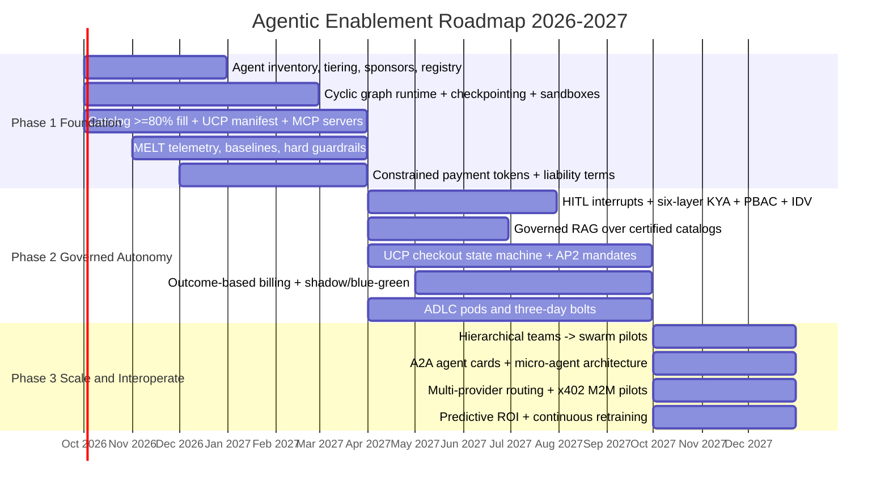

# Agentic Enablement Strategy Guide 2026–2027

### A generic, large-scale platform strategy for autonomous agents in enterprise commerce and operations

| | |
|---|---|
| **Session** | 3am-brainstorming / 092026 / 001 |
| **Date** | 15 September 2026 |
| **Status** | Draft v1 — synthesized strategy |
| **Planning horizon** | Q4 2026 through Q4 2027, with a 2028–2029 north star |
| **Synthesized from** | `README.md`, `AI Agentic Commerce Report 2026.md`, `Capabilities.md`, `topics.md`, `ai_agentic_commerce_infographic_2026.html`, and the *Architectural Evolution: Linear Pipelines vs. Cyclic Agent Orchestration* diagram |

> **How to read this guide.** Part I sets the strategic thesis and the 2026 landscape. Part II defines the generic large-scale solution: a vendor-neutral Agentic Enablement Platform (AEP) and the capabilities it must carry. Part III applies the platform to a portfolio of use cases and case studies. Part IV is the 2026–2027 roadmap with phase gates, KPIs, and operating model. Part V is the pitfalls register and watch list. All market figures, protocol statuses, and regulatory dates are carried forward from the source research as-is; treat them as the working fact base of this session, not as independently re-verified data.

---

## Contents

- **Part I — Thesis and landscape**
  - 1. Executive summary
  - 2. The 2026 landscape: what changed, what failed, what is now standard
- **Part II — The generic large-scale solution**
  - 3. Design principles
  - 4. The Agentic Enablement Platform reference architecture
  - 5. The five-role agent anatomy
  - 6. Orchestration topologies and when to use them
  - 7. Risk tiering: the control spine of the platform
  - 8. Capabilities catalog (six capability groups)
- **Part III — Applying the platform**
  - 9. Use case portfolio
  - 10. Case studies
- **Part IV — Roadmap**
  - 11. The 2026–2027 strategic roadmap
  - 12. KPIs, phase gates, and the operating model
- **Part V — Pitfalls**
  - 13. Pitfalls register and things to watch out for
  - 14. Early-warning indicators
- **Appendices**
  - A. Decision checklists
  - B. Protocol and standards reference
  - C. Unit-of-work and pricing model reference
  - D. Glossary
  - E. Source map

---

# Part I — Thesis and landscape

## 1. Executive summary

**The shift.** Between 2025 and 2026 enterprise AI crossed a phase transition: from isolated, prompt-driven language models to orchestrated multi-agent systems that research, evaluate, negotiate, and execute transactions on behalf of human principals. Software moved from being a passive system of record to being an active participant in enterprise execution. Salesforce's Agentic Work Unit (AWU), which bills for discrete autonomous tasks rather than user logins, is the bellwether of a new unit economy in which the customer is increasingly an algorithm.

**The prize.** The source research projects autonomous agents orchestrating $3–5 trillion of global consumer commerce by 2030 (up to $1 trillion in US retail), $15 trillion of B2B purchasing intermediated by agents by 2028, and 10–25% of US e-commerce sales agent-driven by the end of the decade. Behavior has already moved: 58% of consumers prefer AI tools to traditional search, 94% report high satisfaction with AI-assisted purchases, and AI-driven visits to US retail sites grew 4,700% year over year in early 2025.

**The reality check.** The same research shows the failure rate is brutal. Roughly 85–88% of agentic pilots never reach production. Multi-step autonomous workflows routinely degrade to sub-40% success rates. Gartner expects over 40% of agentic AI projects to be cancelled by 2027 on token cost, unclear ROI, and missing governance. 73% of retailers were not catalog-ready for agents in early 2026. Financial institutions expect a 78% surge in agentic fraud; 97% of organizations suffered AI-facilitated attacks in 2025 at an average direct loss of $4.5 million. And the flagship consumer thesis of 2025, in-chat checkout, was abandoned by March 2026 after converting at one-third the rate of a merchant-site handoff.

**The strategic answer: one platform, not a hundred pilots.** This guide commits the enterprise to a single, generic, large-scale **Agentic Enablement Platform (AEP)**: a vendor-neutral reference architecture on which every agent in the enterprise runs, is registered, is governed, is metered, and is observed. The platform has seven layers, carries six capability groups, hosts agents built on a five-role anatomy, and uses a Tier 0–3 risk model as its control spine. Use cases plug into the platform; they do not each build their own stack.

**Five commitments for 2026–2027.**

1. **Platform over pilots.** Every agent has a persistent non-human identity, a named human sponsor, a risk tier, an approved toolchain, and a pre-approved ROI metric before it touches production. Unmeasured pilots stop.
2. **Deterministic shell, probabilistic core.** Agents reason probabilistically inside a deterministic envelope: cyclic graph orchestration with durable checkpoints, sandboxed execution, schema-validated tools, and hard-coded numeric guardrails that live outside the model.
3. **Discover in AI, transact on your own rails.** Product and service data become machine-readable through standard protocol manifests, while checkout, fulfillment, and settlement stay on owned, higher-converting surfaces reached through protocol-native handoffs.
4. **Trust by construction.** Know Your Agent (KYA) identity, policy-based access control, cryptographic intent mandates, and tamper-evident audit logs are built into the platform, not bolted onto individual agents.
5. **Pay for outcomes, measure everything.** Internal chargeback and external pricing move from seats and raw tokens toward verified outcomes, and every agent reports Human-Intervention Rate, cost per autonomous action, and autonomous resolution rate from day one.

**The roadmap in one line.** *Phase 1 — Foundation* (Q4 2026–Q1 2027) inventories, tiers, and re-platforms; *Phase 2 — Governed Autonomy* (Q2–Q3 2027) turns on write actions behind human-in-the-loop gates, KYA, and cryptographic mandates; *Phase 3 — Scale and Interoperate* (Q4 2027 onward) goes cross-functional, multi-provider, and agent-to-agent; the *2028–2029 north star* is swarm-scale autonomy with on-chain agent reputation and machine-to-machine settlement.

**The pitfalls that matter most.** Pilot purgatory; the token trap; linear chains without checkpoints; shared credentials and orphaned agents; unconstrained pricing autonomy; payment-protocol fragmentation; and a regulatory perimeter that is closing faster than most enterprises are moving. Part V treats each in detail.

---

## 2. The 2026 landscape: what changed, what failed, what is now standard

### 2.1 From copilots to orchestrated multi-agent systems

The fundamental limitation of early generative AI deployments was non-determinism. Single-prompt, single-model architectures, even with ReAct-style reasoning, lacked the stability for multi-step exception handling, tool sprawl, and strict handoff policies. When a linear chain crashed mid-workflow with no resume point, every retry burned the full token cost again, turning inference spend into an unpredictable margin drain.

The response was structural specialization. Multi-agent systems (MAS) decompose a business process into specialized roles handled by distinct agents that coordinate through formal state machines rather than conversational prompts. The source research reports that MAS outperform single-agent designs by over 90% on complex tasks, with 60% fewer errors, 40% faster execution, and 25% lower operating cost. The *Architectural Evolution* diagram in this session captures the shift precisely: the legacy linear pipeline (Input → LLM → Action 1 → Action 2 → Failure → Restart) has been replaced by a cyclic orchestration in which reasoning, action, execution, and error recovery all revolve around a persistent checkpointer, with a human approval gate wired in as a first-class node.

The counter-weight is equally important: roughly 70% of projects scoped for multi-agent autonomy could have been solved with conventional automation or a single tool-using agent at a fraction of the cost. The 2026 lesson is not "use more agents"; it is "bound autonomy inside discrete, repeatable workflows with measurable SLAs."

### 2.2 The protocol layer has consolidated

A year ago every integration was bespoke. In 2026 a small set of open protocols defines how agents connect to systems, to each other, to catalogs, and to money.

| Layer | Protocol | Sponsor / governance | Role | 2026 status (per source research) |
|---|---|---|---|---|
| Agent ↔ system (vertical) | **MCP** — Model Context Protocol | Anthropic, donated to Linux Foundation AAIF | Universal adapter from reasoning engines to tools, databases, and APIs | De facto standard; 97M+ monthly SDK downloads, 10,000+ public servers in year one |
| Agent ↔ agent (horizontal) | **A2A** — Agent-to-Agent | Google, merged with IBM ACP, Linux Foundation AAIF | Discovery, capability negotiation, delegation, long-running task lifecycle via `/.well-known/agent-card.json` | Emerging standard for cross-organization handoffs |
| Commerce discovery and cart | **UCP** — Universal Commerce Protocol (with **ECP** Embedded Checkout) | Google, Shopify, Walmart, Target | Machine-readable catalog manifests at `/.well-known/ucp`, checkout state machine, fulfillment extension | Live in US; expanding to Australia and Canada; dominant for discovery |
| In-surface checkout | **ACP** — Agentic Commerce Protocol | OpenAI, Stripe | Native in-chat checkout | Discontinued March 2026; pivoting to app discovery |
| Payment authorization | **AP2** — Agent Payments Protocol | Google, FIDO Alliance | Cryptographic Intent / Cart / Payment mandates as W3C Verifiable Credentials, rail-neutral | Active; moved to FIDO governance April 2026 |
| Processor credentials | **MPP** — Managed Payments Profile / Shared Payment Tokens | Stripe | Delegated, constrained payment tokens with caps and time limits | Available |
| Card-network credentials | **Visa TAP**, **Mastercard Agent Pay** (MDES Agentic Tokens) | Visa, Mastercard | Agent credentials with card-present-grade fraud protection | Rolling out |
| Machine-to-machine settlement | **x402** | Coinbase, Linux Foundation | HTTP 402 signaling with stablecoin settlement (USDC on Base) for sub-dollar micro-payments | Early adoption for API and compute metering |
| Agent identity and reputation | **ERC-8004**, "RNWY Scores" | Ethereum community | On-chain agent history and decentralized trust metrics | 3-year horizon |

Two consequences follow for strategy. First, the platform must be protocol-native at its edges, exposing UCP manifests and A2A agent cards outward and consuming MCP inward, so that it is discoverable by any agent and can reach any system without bespoke integration. Second, because the payment layer is fragmented, the platform needs a gateway adapter that speaks several rails at once rather than a bet on a single winner.

### 2.3 The in-chat checkout lesson: discover in AI, buy on your own site

The consumer narrative of 2025 assumed purchases would complete inside conversational interfaces. OpenAI's Instant Checkout, built on ACP with Stripe, was shut down in March 2026 after roughly five months and fewer than fifteen live Shopify merchants. Enterprise telemetry showed in-chat completion converting at about one-third the rate of redirecting the shopper to the merchant's own environment; Walmart's leadership publicly called the experience unsatisfying. The infographic in this session indexes the alternatives against the in-chat baseline: embedded site handoff at roughly 3.2x, a UCP protocol manifest at roughly 3.8x, and web-scraped catalogs at 0.8x.

The durable model that replaced it is bifurcated: agents own top-of-funnel discovery and cart construction from deterministic, machine-readable feeds; merchants retain checkout, fulfillment, and the customer relationship on their own surfaces, reached through a protocol handoff (UCP's Embedded Checkout Protocol over JSON-RPC 2.0) when escalation such as delivery scheduling or age verification is required. Merchants that cannot supply real-time structured catalog data will simply be invisible: fill rates below 80% on core attributes cause products to be skipped entirely by agents.

### 2.4 The regulatory perimeter is closing

The legal question "who answers for the machine?" now has draft answers, and they all point at the enterprise operating the agent.

- **Identity gap.** Anti-money-laundering rules such as the Bank Secrecy Act identify a human or corporate "customer"; an agent cannot legally be one. Bad actors exploit the gap with synthetic identities, deepfaked evidence, and bot-driven applications.
- **FTC policy statement (1 July 2026).** Deliberately configuring an AI to prioritize undisclosed goals over factual accuracy is a deceptive practice under Section 5 of the FTC Act. Hallucination and manipulative agent steering are now consumer-protection liabilities, not product-quality issues.
- **AI AGENT Act (S.5051, July 2026).** Would require every consumer-facing agent to be linked to a verifiable human operator, with the FTC as principal authority.
- **EU AI Act Omnibus VII** fixes compliance deadlines for high-risk systems; US state measures such as the No Robot Bosses Act target unreviewed algorithmic decisions.

Strategy consequence: agent identity, human sponsorship, risk tiering, and tamper-evident audit are not compliance afterthoughts; they are prerequisites for operating consumer-facing or financially consequential agents at all in 2027.

### 2.5 The unit-of-work economy

Vendors have fragmented on what to charge for, and this reshapes both what the enterprise buys and how it prices its own agentic services.

| Vendor | Unit | What it measures | Model |
|---|---|---|---|
| Salesforce | Agentic Work Unit (AWU) | A discrete autonomous task completed (record updated, case resolved, alert routed) | Pay for the action taken, not the compute behind it |
| Cognition (Devin) | Agentic Computing Unit (ACU) | Normalized bundle of VM time, inference, and bandwidth | Resource consumption (about $2.25 per ACU pay-as-you-go) |
| Microsoft | Message Credits, AI Builder Credits | Conversation turns; document / workflow steps processed | Consumption for agents, seats for Copilot |
| Anthropic, OpenAI | Tokens | Input and output tokens | Raw compute |
| Intercom (Fin) | Resolutions | A customer objective fully completed without human handoff | Pure outcome (about $0.99 per resolution) |
| Zapier, Make | Tasks / Operations | Each successful action across integrated apps | Action-based quotas |

Per-seat pricing collapses when the user is an algorithm making thousands of calls per minute; raw token metering creates the "token trap" of runaway bills when one request fans out into a dozen sub-agent calls and self-correction loops. The direction of travel is hybrid (base plus metered) now and outcome-based (per verified resolution or accepted quote) within a year. The platform must therefore meter at the workflow level and prove, administratively or cryptographically, that a contracted outcome occurred.

### 2.6 What "standard" looks like in 2026

Pulling the threads together, a production-grade agentic deployment in 2026 is expected to have: cyclic graph orchestration with durable checkpoints and human-in-the-loop interrupt nodes; MCP-based access to certified data catalogs and enterprise systems; sandboxed execution with schema-validated, idempotent tools; a KYA identity per agent with a human sponsor and a risk tier; delegated payment credentials with hard caps; MELT telemetry (metrics, events, logs, traces) at span level; and outcome-level metering. Anything less is a pilot, whatever it is called.

---

# Part II — The generic large-scale solution

## 3. Design principles

The Agentic Enablement Platform (AEP) is deliberately generic: it is a reference solution any large enterprise can implement with open protocols and interchangeable vendors. Eight principles govern every design decision on it.

| # | Principle | What it means in practice | Source pattern it answers |
|---|---|---|---|
| P1 | **Platform over pilots** | One shared runtime, registry, gateway, and telemetry plane; use cases are tenants, not stacks | 85–88% of pilots never reach production; custom builds break at scale |
| P2 | **Deterministic shell, probabilistic core** | The model reasons; the platform decides what it may touch, when it pauses, and what it cannot exceed | Linear chains, infinite loops, hallucinated prices |
| P3 | **Propose → enforce → verify** | Agents propose actions, infrastructure enforces policy, the system verifies the resulting state change before closing the loop | The 3-year "AI-native posture" in the failure-rate case study |
| P4 | **Protocol-native edges** | MCP inward, UCP/A2A outward, multi-rail payments through a gateway adapter | Bespoke integrations and protocol fragmentation |
| P5 | **Least privilege, per agent, per action** | Persistent non-human identity, dynamic policy-based access control, no shared credentials | Identity gap; 97% of enterprises attacked |
| P6 | **Right-size autonomy** | Start read-only or single-task; escalate tier only on measured evidence | 70% of MAS projects over-scoped |
| P7 | **Right-size the model** | Route to small language models for narrow tasks and frontier models for open reasoning, by latency, cost, and complexity | Token trap; runaway compute |
| P8 | **Outcomes are the unit** | Every workflow emits a verifiable outcome event that drives billing, chargeback, and ROI | Per-seat collapse; unclear ROI |

## 4. The Agentic Enablement Platform reference architecture

The platform is organized into seven layers. Layers L1–L6 correspond one-for-one to the six capability groups in the session's `Capabilities.md`; L0 adds the protocol edge where the enterprise meets external agents, consumers, and partners. Every agent, regardless of business domain, runs through all seven.

### 4.1 Layer by layer

**L0 — Channels and protocol edge.** The enterprise's public face to the agentic economy. Outward it publishes machine-readable catalog and capability manifests (UCP at `/.well-known/ucp`), an A2A agent card at `/.well-known/agent-card.json`, and content optimized for generative engines (GEO) rather than classic search. It receives inbound agent traffic behind an ML-driven web application firewall that separates authorized agents from scraping and hoarding bots, and it hosts the multi-rail payments gateway adapter that translates among UCP, ACP, AP2, MPP, card-network tokens, and x402 so that no business workflow ever binds to one rail.

**L1 — Orchestration and workflow engine.** The runtime that turns a business process into a stateful, cyclic directed graph with an explicit typed state object and a durable checkpointer, so that a failure at step four resumes from step three instead of re-running the whole chain. It provides conditional edges, human-in-the-loop (HITL) and human-on-the-loop (HOTL) interrupt nodes, supervisor / hierarchical / swarm coordination, a routing layer that sends each task to the cheapest adequate model (domain SLM or frontier LLM), and a reflection loop that catches exceptions, logs them to memory, and replans without human intervention.

**L2 — Context engine and data foundation.** The layer that makes agents reason over verified ground truth. MCP servers expose ERP, CRM, customer data platform, and logistics systems through one standardized endpoint; ingestion pipelines convert unstructured catalog and operational data into clean, machine-readable form; a governed retrieval-augmented generation (RAG) pipeline queries certified metadata catalogs so agents only see audited definitions and live system state; long-term memory and vector stores supply history without flooding the active context window; and standardized tool orchestrators bridge generation to backends.

**L3 — Safe execution and sandboxing.** Nothing an agent generates runs directly against production. Dynamically synthesized code (SQL, Python) executes first in an isolated sandbox; linters, schema checks, and read-only permission passes validate syntax and non-destructiveness; tools are idempotent by contract so retries never duplicate a financial transaction; and hard-coded circuit breakers stop runaway loops, unauthorized spend, and pricing death spirals at thresholds set outside the model.

**L4 — Identity, governance, and risk (KYA).** The six-layer Know Your Agent model: identity and lifecycle, authentication, authorization with least privilege, runtime policy enforcement, behavioral anomaly monitoring, and auditability. Every agent has a persistent cryptographic identity, a named human sponsor and accountable legal entity, a risk tier, and an approved toolchain recorded in a central registry. Policy-based access control (PBAC) grants tool and transaction rights dynamically by context, tier, and dollar threshold. Tamper-evident logs capture full context, prompts, reasoning steps, tool payloads, and intermediate state for regulators and legal discovery. Real-time identity verification (IDV) of the human sponsor gates Tier 3 actions.

**L5 — Payments and outcome settlement.** Delegated, constrained credentials (shared payment tokens with caps, categories, and time limits) for agent-initiated purchases; AP2-style Intent, Cart, and Payment mandates that bind consent, SKUs, and funding into one verifiable chain; programmable escrow that releases funds when SLAs or delivery milestones are verified; machine-to-machine rails for sub-dollar streaming payments; an outcome metering and attribution engine that measures the exact unit of value delivered; and automated reconciliation of purchase orders, deliverables, and ledger entries.

**L6 — AgentOps: observability, evaluation, and lifecycle.** MELT telemetry (metrics, events, logs, traces) on every tool call, retrieval, and time-to-first-token; a cross-layer lineage graph connecting user intent, planner decisions, and data assets touched; continuous drift, hallucination-rate, and degradation monitoring; probabilistic quality evaluation (precision, recall, intent alignment, safety) rather than deterministic unit tests alone; LLM-as-a-judge evaluators running outside the primary agent's loop; shadow and blue/green deployment against live traffic before cutover; and feedback loops that retrain prompts, exemplars, and weights from production evidence.

### 4.2 Why one generic platform instead of per-domain stacks

Three of the session's case studies converge on the same root cause: custom builds with no shared error recovery, state management, or memory handoff break the moment they leave the pilot sandbox. Centralizing those concerns in a governed platform is what the source research's one-year horizon prescribes for the enterprise failure-rate problem, and it is what makes the three-year "Kubernetes for agents" swarm scale possible at all. Vendor products (packaged agent suites, orchestration frameworks, gateways, IDV providers, payment processors) plug into the layers as interchangeable components; none of them *is* the platform.

## 5. The five-role agent anatomy

Every agent that runs on the platform is built from the same five internal roles, taken from the session's topic breakdown. The roles are the "cell biology" of the platform: they give each agent a predictable shape that the orchestration, sandboxing, and audit layers can inspect and constrain.

| Role | Ability | Responsibility | Built-in check and balance |
|---|---|---|---|
| **1. Context Manager** | Perception | Ingests the task instruction and enriches it with system description, tool description, few-shot demonstrations, and history/memory | Restricts the agent's universe of possibilities by declaring allowed tools and boundaries up front; loads only *relevant* history through dynamic retrieval so the context window never overflows |
| **2. Architect** | Task planning | Decomposes intent into an explicit high-level plan of subtasks with dependencies | Granular state tracking per subtask; subtask N waits for the verified output of subtask N-1; on failure the agent halts and reflects rather than executing blindly |
| **3. Executor** | Tool usage | Selects, creates, and executes tools from the predefined set (database, calculator, REPL) or synthesizes new ones (SQL, Python) | Generated tools pass through the L3 sandbox, linters, and read-only validation before touching live systems |
| **4. Auditor** | Learning, reflection, memory | Evaluates each execution result as correct or exception | Primary feedback loop: on exception, log to memory and route back to planning or execution to replan or rewrite, instead of crashing or looping |
| **5. Reporter** | Summarization | Consolidates final tool output into the deliverable | Compares raw data to the natural-language answer so nothing is invented and nothing requested is dropped |

Four validations, also from the source, are engineered into the platform's evaluation harness so that every agent is tested on the same axes before promotion: **task-decomposition validation** (does the plan get dependencies right?), **execution and syntax validation** (is generated code correct and non-destructive?), **reflection and memory testing** (force a timeout or denied tool and confirm the agent reroutes rather than loops), and **summarization accuracy** (raw output versus final answer).

## 6. Orchestration topologies and when to use them

The platform supports four canonical coordination topologies. Choosing the wrong one is a leading cause of token waste and unbounded behavior, so topology is a registered attribute of every workflow.

| Topology | Mechanism | Use it for | Avoid it when |
|---|---|---|---|
| **Supervisor and workers** | A central orchestrator routes sub-tasks to specialized workers | End-to-end process execution: retrieve, extract, act | The task is one tool call; conventional automation is cheaper |
| **Parallel fan-out / fan-in** | Many agents process separate streams; one synthesizes | Bulk research, high-volume data processing, APIs with varying latency | Steps are dependent; parallelism only multiplies cost |
| **Hierarchical teams** | Manager agents oversee execution agents and report to a root | Multi-domain operations such as procurement plus logistics plus finance | The domain is single and narrow; hierarchy adds handoff loss |
| **Debate / critic** | An execution agent's output is adversarially evaluated by a critic before the next state | Regulated decisions where hallucination must approach zero | Latency-sensitive, low-stakes interactions |

Two engineering rules apply regardless of topology, and both are enforced by the platform rather than by convention: agents use native function-calling with strict JSON schemas for every tool parameter, never free-text parsing; and every tool is idempotent so retries are safe.

## 7. Risk tiering: the control spine of the platform

The Tier 0–3 model from the session's KYA analysis is the single abstraction that ties orchestration, sandboxing, identity, payments, and observability together. Every registered agent and every workflow carries a tier, and the platform's behavior changes mechanically with it.

| Tier | Scope of action | Typical share of workflows (infographic) | Platform behavior |
|---|---|---|---|
| **Tier 0 — Read-only** | Summarization, classification, triage, recommendations | ~40% | No write tools; standard telemetry; auto-approved |
| **Tier 1 — Low-risk write** | Cart edits, ticket routing, draft generation, internal record updates | ~35% | Idempotent write tools; PBAC scope check; HOTL sampling review |
| **Tier 2 — Pre-approved transaction** | Refunds, replacements, orders, and price changes within pre-set caps | ~18% | Hard numeric guardrails; delegated credentials with caps; HITL interrupt on threshold breach; full trajectory logging |
| **Tier 3 — High-stakes financial or legal execution** | Contract execution, large procurement, privileged access, funds transfer above caps | ~7% | Mandatory HITL interrupt; real-time IDV of human sponsor (biometric or government ID); cryptographic intent mandate; critic-agent review; immutable evidence record |

Tier promotion is evidence-driven: an agent moves from Tier 0 to Tier 1, or Tier 1 to Tier 2, only after a measured shadow period with a Human-Intervention Rate and error rate below the thresholds set in Section 12. Tier demotion is automatic when anomaly detection or drift monitoring trips a circuit breaker.

---

## 8. Capabilities catalog

The six capability groups below are the platform's build list. Each entry states what the capability is, why it matters, the maturity the enterprise should reach at each roadmap phase (Phase 1: Q4 2026–Q1 2027; Phase 2: Q2–Q3 2027; Phase 3: Q4 2027 onward), the generic enabling technology (with products the source research cites as illustrations, not mandates), and the pitfall the capability exists to prevent.

### 8.1 Capability group A — Multi-agent orchestration and workflow engines (Layer L1)

| Capability | Why it matters | Phase 1 | Phase 2 | Phase 3 | Enabling technology (generic; source examples) | Pitfall prevented |
|---|---|---|---|---|---|---|
| **A1. Cyclic graph runtime with typed state and durable checkpointing** | Resumes failed workflows from the last good node; eliminates re-run token cost | All new workflows on cyclic graphs; legacy linear chains frozen | Legacy chains migrated or retired | Checkpoint store shared across agent fleets | Stateful graph frameworks (LangGraph; Microsoft Agent Framework 1.0; CrewAI for role-based sequential work; Claude Agent SDK for tool-heavy, MCP-native agents) | Linear chain failure and restart; context overflow |
| **A2. HITL / HOTL interrupt primitives** | Pauses execution at high-value or anomalous decisions for a human | Interrupts defined for all Tier 2–3 actions | Threshold-driven interrupts wired to sponsor devices; HOTL dashboards | HITL decline-rate metric drives tier promotion | Conditional edges routing to interrupt nodes; approval queues | Unreviewed algorithmic decisions; regulatory exposure |
| **A3. Hierarchical and swarm coordination** | Lets specialized agents collaborate across procurement, merchandising, logistics | Supervisor–worker only | Hierarchical teams for cross-functional flows | Swarm workflows for live disruption handling | Orchestrator services; A2A for cross-boundary delegation | Automating a whole department at once |
| **A4. Granular state and dependency management** | Downstream agents halt or reflect when prerequisite inputs fail | Per-subtask checkpoints | Dependency graphs validated in evaluation harness | Cross-agent state handoff via A2A task lifecycle states | Typed state objects; lifecycle states (submitted, working, input-required, failed) | Blind execution on bad inputs |
| **A5. Dynamic multi-provider LLM / SLM routing** | Sends each task to the cheapest adequate model by latency, cost, complexity | Two-model routing (SLM for narrow tasks, frontier for open reasoning) | Cost-aware routing policies per tier | Multi-provider failover and arbitrage | Gateway layers with provider failover (TrueFoundry cited) | Token trap; single-vendor lock-in |
| **A6. Autonomous self-correction loops** | Catches exceptions, logs to memory, replans without a human | Reflection loop mandatory in the five-role anatomy | Loop budgets and retry caps enforced by circuit breakers | Learned recovery strategies shared across agents | Auditor role; exception routing to Architect / Executor | Infinite loops; crash-on-error |

### 8.2 Capability group B — Context engines and unified data foundations (Layer L2)

| Capability | Why it matters | Phase 1 | Phase 2 | Phase 3 | Enabling technology | Pitfall prevented |
|---|---|---|---|---|---|---|
| **B1. MCP server estate** | Decouples agents from proprietary integrations; one endpoint per system of record | MCP servers over catalog, order, and CRM systems | MCP over ERP, CDP, and 3PL; certified metadata catalog connected | Shared MCP registry with versioning and access policies | MCP (Linux Foundation AAIF); metadata platforms (Atlan cited) | Bespoke integration sprawl |
| **B2. Machine-readable catalog and knowledge stores** | Agents skip products with sub-80% attribute fill; hallucinate on scraped data | Structured feeds with ≥80% fill on core attributes; UCP manifest published | Real-time inventory, price, and shipping in feed; fulfillment extension | Programmable digital shelf with personalized assortments | Headless commerce; agentic storefront features (Shopify Spring '26 cited) | Invisibility to discovery agents; hallucinated stock and pricing |
| **B3. Governed RAG and long-term memory** | Supplies history and audited definitions without flooding the context window | Foundational RAG in isolated environments | Centralized knowledge store; RAG over certified catalogs via MCP | Shared real-time enterprise data platform | Vector databases; retrieval pipelines; memory modules | Context overflow; reasoning over unaudited data |
| **B4. Cross-system API tool orchestrators** | Bridges generation to ERP, CRM, CDP, 3PL with strict schemas | Standard connectors for read paths | Idempotent write connectors for Tier 1–2 | Connector marketplace with policy attachments | Function-calling with JSON schemas | Free-text parsing; duplicate transactions |
| **B5. Domain-specific small language models** | Reads and structures legacy data cheaply; narrow tasks at low latency | Evaluate SLMs for parsing and classification | SLMs in production for data normalization | Fine-tuned SLMs per domain fed by feedback loops | SLM hosting; fine-tuning pipelines | Generic-model misalignment; token cost |

### 8.3 Capability group C — Safe execution and tool sandboxing (Layer L3)

| Capability | Why it matters | Phase 1 | Phase 2 | Phase 3 | Enabling technology | Pitfall prevented |
|---|---|---|---|---|---|---|
| **C1. Isolated tool sandboxes** | Generated SQL / Python is validated before it reaches production | Sandbox mandatory for any generated code | Sandbox policies per tier; automatic promotion on pass | Deterministic execution sandboxes across the fleet | Ephemeral runtimes; secure execution environments | Destructive queries in production |
| **C2. Non-destructive validation gates** | Linters, schema checks, and read-only passes catch errors before commit | Linters and schema checks in the Executor path | Read-only dry runs for Tier 2 writes | Automated remediation suggestions | Static analysis; schema registries | Syntactically wrong or destructive actions |
| **C3. Circuit breakers and kill switches** | Stops runaway loops, unauthorized spend, pricing death spirals | Loop budgets, spend caps, and price floors hard-coded outside the LLM | Anomaly-triggered identity revocation | Fleet-wide breakers with blast-radius limits | Gateway spend limits; policy engines | Margin destruction; runaway compute |
| **C4. Idempotent tool contracts** | Retries never duplicate refunds, orders, or payments | Idempotency keys on all write tools | Contract tests in CI | Platform-enforced at connector level | Tool design standards | Cascading database errors; duplicate transactions |

### 8.4 Capability group D — Agent identity, governance, and risk management / KYA (Layer L4)

| Capability | Why it matters | Phase 1 | Phase 2 | Phase 3 | Enabling technology | Pitfall prevented |
|---|---|---|---|---|---|---|
| **D1. Cryptographic non-human identity** | Every agent is attributable; no shared API credentials | Persistent ID per agent; shared credentials eliminated | mTLS / token auth; bilateral verification with external agents | Decentralized identity ledgers (ERC-8004) and trust scores | Identity fabrics for AI; verifiable credentials | Identity gap exploited by attackers |
| **D2. Human sponsor and legal entity linkage** | Satisfies FTC and AI AGENT Act expectations; someone answers for the machine | Sponsor recorded for every workflow | Sponsor IDV (liveness, government ID) for Tier 3 | Sponsor accountability embedded in HR and legal processes | IDV providers (Persona cited) | Orphaned agents; regulatory liability |
| **D3. Policy-based access control** | Grants rights dynamically by context, tier, and dollar value | Least-privilege static scopes | PBAC evaluating value, context, risk in real time | Cross-organization policy federation | Runtime policy engines | Static role lists that over-grant |
| **D4. Central agent registry** | Single source of truth for ownership, boundaries, toolchains, tiers | Inventory complete; all agents registered | Registry drives PBAC and telemetry automatically | Registry federated with partner networks via A2A cards | Registry service; agent cards | Shadow agents; unknown blast radius |
| **D5. Immutable audit and evidence capture** | Tamper-evident record of prompts, reasoning, payloads, states | Full trajectory logging for Tier 2–3 | Lineage graph from intent to data assets; evidence packages for discovery | Cryptographic execution records | Tamper-evident logging platforms | Black-box cancellations; failed regulatory inquiries |
| **D6. Behavioral anomaly detection and HITL / HOTL oversight** | Detects non-human patterns, prompt injection, deviation from baseline | Baseline normal behavior per agent | Anomaly-triggered escalation and kill switch | Zero-trust policy enforcement outside the reasoning loop | Behavioral telemetry; LLM-as-a-judge evaluators | Rogue processes; injected commands |

### 8.5 Capability group E — Agentic payments and outcome settlement (Layer L5)

| Capability | Why it matters | Phase 1 | Phase 2 | Phase 3 | Enabling technology | Pitfall prevented |
|---|---|---|---|---|---|---|
| **E1. Delegated, constrained payment credentials** | Agents transact at 3 a.m. without CVV or OTP, inside caps | Shared payment tokens with spend, category, and time limits | Card-network agent tokens (Visa TAP, Mastercard Agent Pay) | Multi-rail routing by transaction type | Processor suites (Stripe MPP cited); network APIs | Interactive-auth dead ends; unbounded spend |
| **E2. Cryptographic intent mandates** | Binds user consent, cart, and payment into auditable proof; kills chargeback disputes | Design and legal review | AP2 Intent / Cart / Payment mandates live for consumer and B2B flows | Mandates federated across partners | AP2 under FIDO; W3C Verifiable Credentials | Fractured liability chain |
| **E3. Multi-rail gateway adapter** | Hedges protocol fragmentation with one API | Adapter selected; UCP and MPP paths live | AP2 and card-network paths added | x402 and stablecoin path for M2M | Gateway adapters (Adyen Agentic cited); x402 facilitators (Nevermined cited) | Betting on one rail |
| **E4. Programmable escrow** | Releases funds only when an agent verifies SLA or delivery | Pilot on low-value B2B | Escrow for verified-delivery procurement | Smart-contract escrow in agent marketplaces | Escrow services; smart contracts | Phantom bookings; disputed deliverables |
| **E5. Machine-to-machine settlement rails** | Sub-dollar API, data, and compute payments without card fees | Evaluate | Pilot HTTP 402 pay-per-use for internal API metering | Streaming M2M settlement with stablecoin treasury | x402; USDC on Base; protocol-agnostic wallets (Skyfire, Crossmint cited) | Fee destruction on micro-transactions |
| **E6. Outcome metering, attribution, reconciliation** | Bills and charges back per verified outcome; matches PO, deliverable, ledger | Billable-event logging at workflow level | Outcome-based billing for at least one service; automated invoice matching | Real-time reconciliation across the fleet | Resolution meters (Zendesk, Intercom patterns cited); reconciliation engines | Token trap; unproven ROI |

### 8.6 Capability group F — Observability, evaluation, and lifecycle operations / AgentOps (Layer L6)

| Capability | Why it matters | Phase 1 | Phase 2 | Phase 3 | Enabling technology | Pitfall prevented |
|---|---|---|---|---|---|---|
| **F1. MELT telemetry and span-level tracing** | Explains *why* an agent did what it did; prerequisite for every KPI | Every tool call, retrieval, and TTFT logged | Cross-layer lineage graph (intent → plan → data assets) | Fleet-level dashboards tied to financial metrics | Tracing platforms (LangSmith cited); observability suites | Black-box cancellations |
| **F2. Continuous drift and behavioral monitoring** | Catches semantic drift, hallucination-rate creep, degradation | Baselines established | Drift alerts wired to circuit breakers and tier demotion | Predictive drift models | Drift detection systems | Silent model drift (the pricing-loss case) |
| **F3. Probabilistic quality evaluation** | Tests reasoning, intent alignment, safety, not just syntax | Evaluation harness with the four anatomy validations | Precision, recall, hallucination-rate gates in CI | LLM-as-a-judge evaluators outside the agent loop | Evaluation frameworks; judge models | Verification debt |
| **F4. Shadow and blue/green deployment** | New models and workflows run against live traffic before cutover | Shadow mode mandatory for any pricing or payment agent | Blue/green for all Tier 2–3 workflows | Automated canary promotion | Parallel staging infrastructure | Untested logic pushed live |
| **F5. Continuous feedback and retraining loops** | Production evidence tunes prompts, exemplars, and weights | Manual review of rollouts | Automated feedback capture into prompt and exemplar sets | Continuous retraining pipelines | LLMOps CI/CD | Degradation after deployment |
| **F6. ROI and unit-economics dashboards** | Makes agent value legible to executives and finance | HIR, cost per autonomous action, resolution rate baselined | Cost per autonomous action versus manual baseline per workflow | Predictive ROI modeling and compute reallocation | Financial dashboards joined to LLM usage metrics | Hesitant sponsorship; unclear ROI |

### 8.7 Capability maturity summary

| Phase | Orchestration (A) | Context (B) | Safe execution (C) | KYA (D) | Payments (E) | AgentOps (F) |
|---|---|---|---|---|---|---|
| **Phase 1 — Foundation** | Cyclic graphs, checkpoints, interrupts defined | MCP over core systems; catalog ≥80% fill; UCP manifest | Sandboxes, linters, hard guardrails, idempotency | Inventory, registry, tiers, sponsors, no shared creds | Constrained tokens; billable-event logging; liability terms | MELT tracing; baselines; shadow mode for money-touching agents |
| **Phase 2 — Governed autonomy** | Hierarchical teams; routing policies; HITL live | Governed RAG over certified catalogs; SLMs in production | Tier-based sandbox policy; anomaly-triggered revocation | Six-layer KYA; PBAC; sponsor IDV for Tier 3; lineage | AP2 mandates; card-network tokens; escrow; outcome billing | Drift → breakers; probabilistic gates in CI; blue/green |
| **Phase 3 — Scale and interoperate** | Swarms; multi-provider arbitrage; A2A delegation | Shared real-time data platform; MCP registry | Fleet-wide breakers | Federated registry; on-chain identity pilots | Multi-rail routing; x402 M2M pilots | Predictive ROI; continuous retraining |

---

# Part III — Applying the platform

## 9. Use case portfolio

Each use case below is a tenant of the platform, not a stack of its own. For every one, the source research's 6-month / 1-year / 3-year horizons are mapped onto the guide's phases: **Phase 1** (Q4 2026–Q1 2027) carries the 6-month moves, **Phase 2** (Q2–Q3 2027) the 1-year moves, and **Phase 3 / North star** (Q4 2027 and 2028–2029) the 3-year direction. Each entry names the orchestration topology, the risk tier at which it starts and the tier it may earn, the platform layers it leans on hardest, its headline KPI, and the pitfall specific to it.

### 9.1 Agentic discovery and catalog readiness

- **Problem.** 73% of retailers lack machine-readable feeds; scraped data hallucinates stock, price, and shipping; products with sub-80% attribute fill are skipped; in-chat checkout converts at one-third the rate of an owned surface.
- **Pattern.** Parallel fan-out ingestion agents normalize catalog data; a supervisor publishes and monitors the UCP manifest. **Tier 0 → Tier 1.** Layers L0, L2.

| Phase | Move |
|---|---|
| Phase 1 | Abandon scraper reliance. Publish `/.well-known/ucp` JSON manifests with Catalog capabilities; reach ≥80% fill on core attributes; adopt Embedded Checkout Protocol handoffs so checkout stays on owned surfaces; expose internal product data through MCP. |
| Phase 2 | Implement the UCP Checkout State Machine (`incomplete` → `requires_escalation` → `ready_for_complete`) and the Fulfillment Extension for split shipments across distributed inventory; dynamic capability negotiation per transaction. |
| Phase 3 / North star | Publish an A2A agent card; bidirectional agent-to-agent bidding where the merchant agent bids for placement in consumer AI wallets and B2B RFPs; programmable digital shelf with personalized assortments and universal multi-retailer carts with embedded BNPL. |

- **Enablement.** Headless commerce; agentic storefront features on commerce platforms; MCP servers over ERP; multi-standard gateway adapter (UCP, ACP, Meta AI); generative engine optimization for the content layer.
- **KPI.** Attribute fill rate; agent-referred sessions; agent-driven conversion lift versus in-chat baseline (source indexes: site handoff ~3.2x, UCP manifest ~3.8x).
- **Watch out for.** Re-litigating in-chat checkout; treating the feed as a one-time export rather than a real-time system; skipping the escalation states so agents complete carts they should have handed off.

### 9.2 Real-time dynamic merchandising (B2C autonomous shopping)

- **Problem.** Static, rules-based storefronts miss micro-trends and individual intent.
- **Pattern.** Supervisor with recommendation, layout, and content workers; critic agent for brand safety. **Tier 0 → Tier 1.** Layers L2, L6.

| Phase | Move |
|---|---|
| Phase 1 | Predictive recommendation widgets from immediate session clicks. |
| Phase 2 | Dynamic page layouts reorganizing categories and hero banners on real-time demographic and contextual signals from the CDP. |
| Phase 3 / North star | Fully generative storefronts synthesizing descriptions, imagery, and bundles per user in real time. |

- **Enablement.** Real-time customer data platform; low-latency generation APIs; high-throughput rendering; content moderation guardrails.
- **KPI.** Conversion and average order value lift versus static control; moderation rejection rate.
- **Watch out for.** Generated content that violates brand or regulatory claims; FTC Section 5 exposure if steering is undisclosed; latency budgets blown by frontier-model calls on every page view (route to SLMs).

### 9.3 Self-healing post-purchase resolution and support

- **Problem.** Exceptions (lost packages, defective items) bottleneck service, degrade loyalty, and inflate cost. The source blueprint: e-commerce support agents reaching 72%+ autonomous resolution and 40% lower support cost.
- **Pattern.** Supervisor–worker with sentiment, logistics, and payments workers; HITL interrupt above refund caps. **Tier 1 → Tier 2.** Layers L1, L3, L5.

| Phase | Move |
|---|---|
| Phase 1 | Automated ticket routing and AI-drafted responses for human agents; outcome (resolution) logging from day one. |
| Phase 2 | Autonomous customer-facing agents issue refunds, order replacements, and route logistics within pre-approved financial limits, with idempotent tools and HITL above thresholds. |
| Phase 3 / North star | Predictive exception management: the agent detects a logistics failure, ships a replacement, and notifies the customer before a complaint is filed. |

- **Enablement.** 3PL network APIs via MCP; fine-tuned sentiment models; payment gateway integration; delegated credentials with caps.
- **KPI.** Autonomous resolution rate (target trajectory toward 72%+); Human-Intervention Rate; cost per resolution versus manual baseline.
- **Watch out for.** Non-idempotent refund tools that double-pay on retry; agents "resolving" by over-refunding; measuring deflection rather than genuine resolution.

### 9.4 Return mitigation (reverse-logistics margin protection)

- **Problem.** Returns cost 45–65% of an item's original price; legacy analytics intercept causes only after logistics are mobilized.
- **Pattern.** Pre-purchase fit and sizing agents (Tier 0) plus post-purchase decision-intelligence routing agents (Tier 1–2). Layers L2, L1.

| Phase | Move |
|---|---|
| Phase 1 | Pre-purchase generative fit, sizing, and personalized recommendation agents; target 25–30% reduction in preventable size-related returns. |
| Phase 2 | Post-purchase decision intelligence routes returned inventory by predictive resale value and steers customers toward retained-revenue exchanges over refunds. |
| Phase 3 / North star | Closed self-healing loop across pre- and post-purchase reaching up to 60% reduction in preventable returns. |

- **Enablement.** 3D digital-twin fit simulators; Returns Processing Cycle Time monitoring; peer-to-peer dynamic routing; automated return policy engines.
- **KPI.** Preventable return rate; exchange-versus-refund ratio; Returns Processing Cycle Time.
- **Watch out for.** Steering that suppresses legitimate refunds (consumer-protection risk); fit models trained on incomplete catalog attributes.

### 9.5 Dynamic yield pricing and revenue optimization

- **Problem.** Inflexible pricing loses margin in demand spikes and strands stock in downturns; unconstrained agents cause margin destruction through hallucinated discounts and competitive death spirals (a top commercial food producer lost millions when unvalidated prices went live).
- **Pattern.** Debate / critic topology with a pricing proposer and a margin critic; guardrails enforced in L3, never in the prompt. **Tier 1 → Tier 2, never Tier 3 without HITL.** Layers L3, L6.

| Phase | Move |
|---|---|
| Phase 1 | Automated competitor monitoring and rules-based matching; absolute cost-plus price floors, willingness-to-pay ceilings, and change-velocity limits hard-coded outside the LLM; shadow mode for several weeks against live data before any autonomy. |
| Phase 2 | Predictive pricing on inventory velocity and macro signals; pack-size normalization; scenario simulators. |
| Phase 3 / North star | Double Machine Learning demand-elasticity models and reinforcement-learning agents executing counter-offers and yield adjustments within the fixed boundaries, optimizing gross margin return on investment. |

- **Enablement.** High-frequency market data APIs; DoubleML frameworks; scenario simulators; gateway spend and change limits.
- **KPI.** Gross margin return on investment; guardrail breach attempts (should be logged, never executed); price-change velocity.
- **Watch out for.** Silent model drift; guardrails expressed as prompt instructions instead of numeric constraints; collusion-like dynamics with competitor agents.

### 9.6 Autonomous B2B procurement negotiation

- **Problem.** Manual procurement is slow and labor-intensive and leaves value on the table in routine bulk orders and renewals; the B2B prize is $15 trillion of agent-intermediated purchasing by 2028.
- **Pattern.** Hierarchical teams (tender extraction, capacity validation, negotiation, PO generation) with Tier 3 HITL and IDV for contract execution. **Tier 1 → Tier 3.** Layers L1, L4, L5.

| Phase | Move |
|---|---|
| Phase 1 | Agent-assisted contract drafting and historical price-matching alerts for human buyers. |
| Phase 2 | Autonomous bidding agents for low-risk, high-volume commodity purchases within strict financial parameters; programmable escrow released on verified delivery. |
| Phase 3 / North star | Multi-agent, multi-variable negotiation (price, delivery terms, SLAs) across organizational boundaries via A2A, with packaged enterprise suites coordinating tenders and purchase orders. |

- **Enablement.** Secure natural-language negotiation engines; deep ERP integration via MCP; legally binding smart-contract frameworks; A2A agent cards for counterpart discovery.
- **KPI.** Cycle time per order; realized savings versus historical price; escalation rate on Tier 3 actions.
- **Watch out for.** Counterparty agents with no verifiable identity (KYA on both sides); mandates that do not bind scope tightly enough; "agent purchases $10,000 instead of $1,000" liability with no cryptographic proof of intent.

### 9.7 Agentic payments and machine-to-machine settlement

- **Problem.** Payment rails assume synchronous human checks; agents make purchases at 3 a.m.; fraud is expected to surge 78%; protocols are fragmented; card fees destroy sub-dollar micro-transactions.
- **Pattern.** Platform-level capability consumed by every transacting use case; not a standalone agent. **Tier 2–3.** Layers L0, L5, L4.

| Phase | Move |
|---|---|
| Phase 1 | Shared payment tokens with spend caps, categories, and time limits; automated invoice matching and reconciliation; merchant agreements rewritten to allocate liability for agent-initiated errors. |
| Phase 2 | AP2 Intent / Cart / Payment mandates as verifiable credentials; card-network agent tokens; programmable escrow tied to SLA verification. |
| Phase 3 / North star | Multi-rail routing by transaction type; HTTP 402 / x402 stablecoin settlement for API, data, and compute micro-payments; native stablecoin treasury. |

- **Enablement.** Multi-rail gateway adapter; x402 facilitators; protocol-agnostic agent wallets; verifiable credentials.
- **KPI.** Chargeback rate on agent-initiated transactions; unauthorized-transaction rate; settlement cost per transaction.
- **Watch out for.** Single-rail lock-in; delegated tokens without expiry; treasury and accounting controls for stablecoins lagging the engineering.

### 9.8 Supply chain exception handling

- **Problem.** Messy inputs and dynamic exceptions produce slow cycle times, siloed operations, and high friction.
- **Pattern.** Single-agent pilots first, then hierarchical, then swarm. **Tier 0 → Tier 2.** Layers L2, L1.

| Phase | Move |
|---|---|
| Phase 1 | Single-agent pilots for isolated tasks such as inventory document parsing. |
| Phase 2 | Hierarchical multi-agent orchestration: forecast shortages, generate purchase orders, route alerts across forecasting, procurement, and finance. |
| Phase 3 / North star | Autonomous swarm workflows resolving live logistics disruptions end to end. |

- **Enablement.** Enterprise workflow engines; real-time integration bridging physical operations with finance; change-management programs.
- **KPI.** Exception resolution cycle time; cost per autonomous action versus manual baseline.
- **Watch out for.** Jumping to swarms before hierarchical coordination is proven; organizational resistance without a change-management program.

### 9.9 Agentic software delivery: SDLC → ADLC → AI-native SDLC

- **Problem.** Two-week sprints and phase gates bottleneck systems that generate, test, and iterate code in minutes; human review capacity cannot match agent output volume, creating verification debt and supply-chain risk; deployment is no longer the finish line because probabilistic systems degrade.
- **Pattern.** Cross-functional pods of humans and agents; agentic coding platforms with MCP; critic agents in CI. **Tier 1 → Tier 2.** Layers L3, L6.

| Phase | Move |
|---|---|
| Phase 1 | Keep Agile/Scrum; AI assists individual developer tasks; strict human review of all AI-generated pull requests; static AI security scanning in CI/CD; basic post-deployment monitoring of AI-generated rollouts. |
| Phase 2 | Agentic Development Life Cycle: three-day "bolts" defining intent, expected outputs, and validation checkpoints; pods where humans brief agents and review at gates; probabilistic metrics (precision, recall, hallucination rate) on agent output; shadow / blue-green deployments treated as the start of behavioral monitoring. |
| Phase 3 / North star | AI-native SDLC: machine-paced continuous delivery; engineers govern code rather than write it; agentic security systems that remediate as code is written; continuous retraining loops from production signals. |

- **Enablement.** Agentic coding platforms; agentic development security platforms; human-agent accountability models; upskilling toward architectural oversight.
- **KPI.** Lead time per change; escaped-defect rate on agent-authored code; review coverage of agent PRs.
- **Watch out for.** Abandoning human review before probabilistic gates exist; "bolts" without validation checkpoints; supply-chain risk from agent-installed dependencies.

### 9.10 Portfolio prioritization

| Use case | Starting tier | Value (source evidence) | Readiness prerequisites | Recommended start |
|---|---|---|---|---|
| Catalog readiness and discovery | 0 | Existential: invisible without it; 3.8x conversion index | Data engineering; MCP over catalog | **Phase 1, first** |
| Post-purchase resolution and support | 1 | 72%+ autonomous resolution, 40% cost reduction | Idempotent tools; outcome logging | **Phase 1** |
| Return mitigation | 0 | 25–30% fewer preventable returns near-term | Catalog attribute quality | Phase 1 |
| Supply chain exception handling | 0 | Cycle-time and friction reduction | Document ingestion; SLMs | Phase 1 (pilots) |
| Agentic software delivery | 1 | Velocity; verification debt control | CI security scanning; evaluation harness | Phase 1 (assist) → Phase 2 (ADLC) |
| Dynamic merchandising | 0 | Conversion lift | CDP; moderation | Phase 2 |
| Dynamic yield pricing | 1 | Margin; also highest known loss case | Hard guardrails; shadow mode; drift monitoring | Phase 2 (after shadow period) |
| Agentic payments and settlement | 2 | Enables every transacting flow | Gateway adapter; legal terms; KYA | Phase 1 (tokens) → Phase 2 (mandates) |
| B2B procurement negotiation | 1 → 3 | $15T market; largest upside and liability | Six-layer KYA; IDV; escrow; A2A | Phase 1 (assist) → Phase 2 (bounded bidding) → Phase 3 |

The sequencing rule is simple: **Tier 0 use cases fund and de-risk the platform; Tier 2–3 use cases only start once the platform's KYA, sandboxing, and payments capabilities have reached Phase 2 maturity.**

---

## 10. Case studies

The case studies below are drawn from the session's research and organized as evidence for the platform strategy. Four are industry deployments framed on the same 6-month / 1-year / 3-year horizons as the use cases; the rest are ecosystem and failure cases whose lessons shape the platform's design. Each ends with the lesson the generic platform absorbs.

### 10.1 Healthcare and life sciences: autonomous care and claims administration

- **Situation.** Medical agents suffer massive discovery and execution drop-off because electronic health records are fragmented and clinical notes are unstructured. At the same time, bot-driven synthetic identities target automated claims and prescription-refill systems, so identity verification must satisfy HIPAA and patient safety.
- **Resolution horizons.** *6 months:* data-normalization agents that parse clinical notes into standard formats (FHIR) to build data readiness; execution capabilities limited; multi-factor biometric authentication mandatory for human-in-the-loop approvals. *1 year:* domain-specific small language models structure legacy clinical data into agent-readable knowledge graphs; behavioral telemetry detects non-human patterns in scheduling and portal access. *3 years:* a zero-trust federated health data network where agents authenticate across hospital systems with cryptographic credentials and negotiate care plans without exposing raw patient data.
- **Enablement.** FHIR APIs; HIPAA-compliant LLM sandboxes; biometric identity fabrics; federated learning environments.
- **Lesson for the platform.** Data readiness precedes autonomy, and the most regulated domains start with Tier 0 normalization agents. The platform's L2 ingestion pipelines, L3 compliant sandboxes, and L4 biometric HITL are the same components healthcare needs; nothing here is domain-specific except the data standard.

### 10.2 Insurance: automated underwriting and claims resolution

- **Situation.** Claims agents stall because inputs (photos, handwritten police reports, varied document formats) lack structured attributes, while deepfaked images and video of accidents and property damage are engineered specifically to exploit automated payouts.
- **Resolution horizons.** *6 months:* strict data-readiness gates (no underwriting on incomplete structured attributes); multimodal ingestion extracts metadata from uploads; mandatory human review on any anomaly flag. *1 year:* forensic models for deepfake, altered-metadata, and synthetic-imagery detection embedded in the agent's initial assessment loop. *3 years:* end-to-end agentic resolution that cross-references verified IoT telematics (crash sensors, smart-home monitors) against cryptographic evidence hashes, bypassing manipulable visual evidence entirely.
- **Enablement.** Multimodal models; image-forensics APIs; media-provenance standards (C2PA); telematics ingestion rails.
- **Lesson for the platform.** Adversaries attack the *inputs* of autonomous systems, not just their outputs. The platform's L3 validation gates must include evidence-authenticity checks, and the long-term answer is cryptographically verifiable data sources over human-interpretable ones.

### 10.3 Government and public sector: citizen service automation

- **Situation.** Adoption is paralyzed by siloed legacy databases (tax, property, licensing) that prevent agents from forming complete context, while citizen-facing agents invite benefit fraud from deepfakes, automated applications, and synthetic identities.
- **Resolution horizons.** *6 months:* internal co-pilots for document classification and triage only, air-gapped from transactional execution or fund disbursement. *1 year:* public-facing conversational agents authenticated through national digital ID with localized biometric liveness checks to block bot-driven mass applications. *3 years:* end-to-end autonomous civic service delivery governed by continuous LLM-as-a-judge evaluators and multi-agency data enclaves that cross-verify identity without exposing PII.
- **Enablement.** Digital public infrastructure; liveness and biometric APIs; sovereign cloud enclaves; public-sector data classification ontologies.
- **Lesson for the platform.** The tier ladder is the deployment plan: Tier 0 internal triage, then authenticated Tier 1–2 citizen interactions, then governed autonomy. The evaluator lives *outside* the agent's reasoning loop, which is exactly how L6 is designed.

### 10.4 Travel, hospitality, and ticketing: agentic booking networks

- **Situation.** Consumer travel agents abandon complex bookings because global distribution systems lack standardized attributes (room layouts, real-time amenities, flight constraints). Malicious bot networks hoard inventory, scrape dynamic pricing, and scalp tickets at scale, distorting market signals.
- **Resolution horizons.** *6 months:* standardize supplier API data structures; ML-powered web application firewalls filter high-velocity scraping. *1 year:* authenticated agent marketplaces where B2B and B2C booking agents are cryptographically verified before reaching live inventory and pricing, cutting off anonymous bots. *3 years:* decentralized travel clearinghouses where agents negotiate dynamic packages with smart-contract escrow that eliminates phantom bookings and hoarding.
- **Enablement.** NDC (New Distribution Capability); cryptographic agent wallets; bot-behavior analytics; distributed-ledger ticketing rails.
- **Lesson for the platform.** Discoverability and defense are the same layer: L0 must both publish machine-readable capability and authenticate who is calling. Agent marketplaces are KYA applied to inbound traffic.

### 10.5 The e-commerce support agent: a single-domain success blueprint

- **Situation.** Specialized 2025–2026 deployments of autonomous e-commerce support agents reached 72%+ autonomous resolution and cut support costs by 40%.
- **What made it work.** A narrow, repeatable workflow with a measurable SLA; outcome-level metering (the resolution); pre-approved financial limits for refunds and replacements; escalation to humans on anything outside scope.
- **How it scales.** The source's one-year prescription is to grow single-domain wins into cross-functional capability through modular "micro-agent" architectures that reach catalog and execution data through MCP, then, at three years, into swarm-scale closed-loop systems across thousands of endpoints.
- **Lesson for the platform.** Bounded scope plus outcome metering is the reproducible pattern. The platform makes it repeatable by giving every micro-agent the same registry entry, tool contracts, and telemetry.

### 10.6 In-chat checkout: the failed thesis (negative case)

- **Situation.** OpenAI's Instant Checkout, on the Agentic Commerce Protocol with Stripe, launched with the assumption that consumers would complete purchases inside the chat surface.
- **What happened.** Fewer than fifteen Shopify merchants went live; conversion inside the chatbot ran at about one-third of merchant-site handoff; Walmart's leadership called the experience unsatisfying; the product was shut down in March 2026 after roughly five months. The Universal Commerce Protocol, launched at NRF in January 2026 by Google, Shopify, Walmart, and Target, filled the vacuum with a discovery-and-handoff model.
- **Lesson for the platform.** Own the surface where value converts. L0 exists to make the enterprise discoverable *and* to hand off to owned checkout; the platform never routes final conversion through a third-party conversational surface by default.

### 10.7 The unconstrained pricing agent (negative case)

- **Situation.** A top commercial food producer deployed an optimization application with authority to push prices live without human validation.
- **What happened.** Aggressive prices went live; the company reportedly lost millions; the post-mortem pointed to silent model drift, hallucinated pricing logic, and compliance exposure.
- **Lesson for the platform.** Numeric guardrails belong in L3, outside the model, as absolute floors, ceilings, and change-velocity limits; drift monitoring in L6 must be wired to circuit breakers; and any money-touching agent runs in shadow mode for weeks before autonomy. Creativity is the agent's greatest asset and its greatest financial hazard.

### 10.8 Packaged enterprise agent suites (ecosystem case)

- **Situation.** Salesforce Agentforce reached $800 million in annual revenue growing 169% year over year in 2026 by embedding agents directly in its data cloud behind a trust layer, bypassing brittle ETL. SAP Joule spans 35 enterprise solutions with 40+ specialized agents that extract tender requirements, validate production capacity, and trigger purchase orders.
- **Lesson for the platform.** Packaged suites are the three-year destination for cross-departmental coordination, and they plug into the platform as L1/L2 tenants rather than replacing it. The enterprise still owns identity, policy, audit, and outcome metering across suites; otherwise each suite becomes its own ungoverned island.

### 10.9 Protocol adoption at ecosystem scale (ecosystem case)

- **Situation.** MCP achieved over 97 million monthly SDK downloads and more than 10,000 public servers within its first year after being donated to the Linux Foundation; A2A absorbed IBM's Agent Communication Protocol; AP2 moved under FIDO governance in April 2026.
- **Lesson for the platform.** Protocol convergence is real and fast on the integration and identity layers, and still fragmented on payments. Build on the converged layers; adapt across the fragmented one.

### 10.10 The aggregate failure case: pilot purgatory

- **Situation.** Over 85% of enterprise agentic projects fail to move from proof of concept to production; roughly 88% of pilots never ship, largely from inadequate risk management and unbounded autonomy; multi-step workflows degrade to sub-40% success on API timeouts, compounding context errors, and missing production architecture; "black box" deployments are cancelled after pilot because nobody can explain why the agent decided what it did.
- **What the research prescribes.** Halt unmeasured pilots; require pre-approved ROI metrics; start read-only or single-task; move to centralized, governed platforms with standardized error recovery, state-managed pauses, and memory handoff; instrument MELT telemetry and lineage from day one; end at a posture where agents propose, infrastructure enforces, and the system verifies.
- **Lesson for the platform.** This case *is* the platform's charter. Every principle in Section 3 traces to one of these failure modes.

---

# Part IV — Roadmap

## 11. The 2026–2027 strategic roadmap

The roadmap runs from Q4 2026 through Q4 2027 in three phases, each with an entry condition, a set of moves across the seven platform layers, and an exit gate. The source research's 6-month, 1-year, and 3-year horizons map to Phase 1, Phase 2, and the Phase 3 / north star respectively.

### 11.1 Phase 1 — Foundation (Q4 2026 – Q1 2027)

**Intent.** Stop the bleeding, know what you have, and re-platform. No new autonomy is granted in this phase; existing autonomy is inventoried and bounded.

| Layer | Moves |
|---|---|
| L0 Edge | Publish UCP catalog manifest; adopt Embedded Checkout Protocol handoff; deploy ML-driven WAF against scraping and hoarding bots; select the multi-rail payments gateway adapter |
| L1 Orchestration | Freeze new linear chains; stand up the cyclic graph runtime with typed state and durable checkpointing; define HITL interrupt points for every Tier 2–3 action (not yet live); two-model routing (SLM / frontier) |
| L2 Context | Data engineering sprint to ≥80% attribute fill on core catalog fields; MCP servers over catalog, order, and CRM systems; foundational RAG in isolated environments |
| L3 Safe execution | Sandbox mandatory for generated code; linters and schema checks; idempotency keys on all write tools; hard-coded price floors, ceilings, velocity limits, loop budgets, and spend caps |
| L4 KYA | Enterprise agent inventory; classify every workflow Tier 0–3; persistent non-human ID per agent; eliminate shared credentials; record human sponsor and accountable legal entity; central registry live |
| L5 Payments | Shared payment tokens with spend, category, and time caps; billable-event logging at workflow level; automated invoice matching; merchant and processor agreements rewritten for agent-error liability |
| L6 AgentOps | MELT telemetry on every tool call, retrieval, and TTFT; baseline HIR, cost per autonomous action, and resolution rate; shadow mode for any pricing or payment agent; evaluation harness with the four anatomy validations |
| Operating model | Halt unmeasured pilots; mandate pre-approved ROI metrics for every initiative; platform team chartered; governance council formed; AI used as developer assist within existing sprints |

**Exit gate (end of Q1 2027).** 100% of production agents registered with tier and sponsor; zero shared credentials; all Tier 2–3 workflows on the cyclic runtime with checkpoints; catalog fill ≥80% and UCP manifest live; MELT coverage on 100% of agent tool calls; every active initiative has a baseline and an ROI metric.

### 11.2 Phase 2 — Governed Autonomy (Q2 – Q3 2027)

**Intent.** Turn on write actions and money movement behind human gates, cryptographic consent, and continuous evaluation. Tier promotions happen here, on evidence.

| Layer | Moves |
|---|---|
| L0 Edge | UCP Checkout State Machine (`incomplete` → `requires_escalation` → `ready_for_complete`) and Fulfillment Extension for split shipments; authenticated agent access for partner agents; generative engine optimization program |
| L1 Orchestration | HITL interrupts live and wired to sponsor devices; HOTL dashboards; hierarchical teams for the first cross-functional flows (post-purchase, supply chain); cost-aware routing policies per tier; retry caps enforced by breakers |
| L2 Context | Governed RAG over certified metadata catalogs via MCP; MCP servers over ERP, CDP, and 3PL; centralized long-term memory store; domain SLMs in production for parsing and classification |
| L3 Safe execution | Tier-based sandbox policy; read-only dry runs for Tier 2 writes; anomaly-triggered identity revocation |
| L4 KYA | Six-layer KYA operational (identity, auth, scope, policy, anomaly, audit); PBAC evaluating value, context, and risk in real time; sponsor IDV (biometric or government ID) before any Tier 3 execution; lineage graph from intent to data assets; evidence packages for FTC-style inquiries and discovery |
| L5 Payments | AP2 Intent / Cart / Payment mandates as verifiable credentials; card-network agent tokens; programmable escrow for verified-delivery procurement; outcome-based billing live for at least one internal or external service |
| L6 AgentOps | Drift and hallucination-rate alerts wired to circuit breakers and tier demotion; probabilistic gates (precision, recall, hallucination rate) in CI; blue/green deployment for all Tier 2–3 workflows; automated feedback capture into prompt and exemplar sets |
| Operating model | Agentic Development Life Cycle: three-day bolts, human-agent pods, review at defined gates; cross-industry-comparable dashboards of cost per autonomous action versus manual baseline; governance council reviews every tier promotion |

**Exit gate (end of Q3 2027).** At least three use cases operating at Tier 2 with HIR below target and zero guardrail breaches executed; Tier 3 flows demonstrably blocked without sponsor IDV; AP2 mandates on all agent-initiated consumer and B2B purchases; outcome-based billing proven on one service; drift alerts exercised at least once in production with automatic demotion.

### 11.3 Phase 3 — Scale and Interoperate (Q4 2027 onward)

**Intent.** Go cross-functional, multi-provider, and agent-to-agent. Begin the three-year transitions without waiting for them to be finished.

| Layer | Moves |
|---|---|
| L0 Edge | A2A agent card published; first bidirectional agent-to-agent negotiations (merchant agent bidding into consumer wallets and B2B RFPs); universal-cart participation |
| L1 Orchestration | Swarm workflow pilots for live logistics disruption; multi-provider LLM arbitrage with failover; A2A task-lifecycle delegation across organizational boundaries; packaged enterprise suites onboarded as governed tenants |
| L2 Context | Shared real-time enterprise data platform; versioned MCP registry with access policies; fine-tuned SLMs fed by feedback loops |
| L3 Safe execution | Fleet-wide circuit breakers with blast-radius limits; deterministic verification loops (propose → enforce → verify) closing every Tier 2–3 action |
| L4 KYA | Registry federated with partner networks; pilots of decentralized agent identity (ERC-8004) and trust scores for counterpart acceptance; zero-trust policy enforcement outside the reasoning loop |
| L5 Payments | Multi-rail routing by transaction type (goods vs. continuous compute); HTTP 402 / x402 pilots for API and data micro-payments; stablecoin treasury controls |
| L6 AgentOps | Predictive ROI modeling with dynamic compute reallocation toward the most profitable workflows; continuous retraining pipelines; LLM-as-a-judge evaluators standard on all Tier 2–3 flows |
| Operating model | Engineers move toward governing code; AI-native delivery loops piloted on low-risk services; benchmarking against external agentic-commerce indices |

**Exit gate (end of Q4 2027).** One swarm or hierarchical cross-functional workflow in production with measured cycle-time gains; A2A card live and at least one external agent negotiation completed under escrow; multi-provider routing reducing cost per autonomous action versus Phase 2 baseline; x402 pilot settled at least one M2M transaction end to end.

### 11.4 North star (2028–2029)

The three-year horizons from the source research define the direction the platform is built to reach without re-architecture: bidirectional A2A bidding and programmable digital shelves; enterprise-wide packaged agent fleets coordinating tenders and procurement; streaming machine-to-machine settlement with stablecoin rails; on-chain agent identity and reputation across B2B networks; autonomous yield management on causal elasticity models within fixed guardrails; predictive exception management that fixes problems before customers notice; and an AI-native software life cycle in which humans design intent and govern outcomes.

## 12. KPIs, phase gates, and the operating model

### 12.1 Platform KPIs

| KPI | Definition | Phase 1 target | Phase 2 target | Phase 3 target |
|---|---|---|---|---|
| **Human-Intervention Rate (HIR)** | Share of workflow runs escalated to a human | Baseline per workflow | Declining quarter over quarter per tier; Tier 1 < 10% | Tier 1 < 5%; Tier 2 < 15% |
| **HITL decline rate** | Share of human approvals that reject the agent's proposal | Not measured | < 10% on Tier 2 (higher means the agent proposes badly) | < 5% |
| **Autonomous resolution rate** | Share of cases closed without human handoff (support, exceptions) | Baseline | Trajectory toward 72%+ blueprint | ≥ 72% on mature workflows |
| **Cost per autonomous action** | Fully loaded compute plus platform cost per completed action | Baseline versus manual cost | ≤ 50% of manual baseline on Tier 1 flows | Declining via routing and SLMs |
| **Workflow success rate** | Multi-step runs completing to a verified outcome | > 40% (the failure threshold in the research) | > 80% | > 90% |
| **Catalog attribute fill rate** | Core attributes populated in machine-readable feed | ≥ 80% | ≥ 90% with real-time inventory | ≥ 95% |
| **Agent-driven conversion lift** | Conversion of agent-referred sessions vs. baseline | Measured | ≥ 3x in-chat baseline via handoff | Sustained |
| **Guardrail breach attempts** | Proposed actions blocked by L3 limits | Logged | Trending down; zero executed | Zero executed |
| **Chargeback rate (agent-initiated)** | Disputed agent transactions | Baseline | Below human-initiated baseline after mandates | Near zero on mandated flows |
| **Drift and hallucination rate** | Evaluator-scored deviation from baseline | Baseline | Alerts wired to breakers | Predictive |
| **Registry coverage** | Production agents with ID, tier, sponsor, toolchain | 100% | 100% | 100% including partner agents |
| **Time to first token / latency** | Per span | Logged | Within SLA per tier | Optimized by routing |
| **Verification-debt ratio** | Agent-authored code changes without probabilistic evaluation | Measured | < 10% | ~0% |

### 12.2 Phase gates as decisions

Each exit gate in Section 11 is a governance council decision with three possible outcomes: **proceed** (all criteria met), **proceed with conditions** (specific use cases held back at current tier), or **hold** (platform capability gap blocks promotion). No use case is promoted a tier by exception; the gate criteria are the same for every tenant.

### 12.3 Operating model

| Role | Accountability |
|---|---|
| **Executive sponsor** | Owns the platform investment case and the "platform over pilots" mandate; chairs the governance council |
| **Platform team** | Builds and runs layers L0–L6 as a product; publishes tool contracts, connector standards, evaluation harness, and dashboards |
| **Governance council** | Legal, risk, finance, security, and platform leads; assigns tiers, approves promotions, owns the pitfalls register |
| **Human sponsor (per agent)** | Named individual legally accountable for a workflow; receives HITL interrupts; completes IDV for Tier 3 |
| **Domain pods** | Cross-functional human-and-agent teams delivering use cases in three-day bolts under the ADLC |
| **AgentOps** | Runs telemetry, drift monitoring, shadow deployments, incident response, and kill-switch authority |
| **Finance partner** | Owns outcome metering, chargeback, hybrid and outcome-based pricing, and the token-cost budget |

### 12.4 Funding and pricing posture

The enterprise adopts hybrid pricing (base plus metered) for anything it buys and sells in Phase 1, moves at least one service to outcome-based billing in Phase 2, and budgets agent compute per workflow with hard caps enforced at the gateway. Internal chargeback follows the same unit as external pricing, the verified outcome, so that ROI dashboards and invoices reconcile.

---

# Part V — Pitfalls

## 13. Pitfalls register and things to watch out for

The register groups every failure mode surfaced in the session's research by the layer or discipline it lives in, states the symptom, the platform control that prevents it, and the phase by which that control must exist. It is owned by the governance council and reviewed at every phase gate.

### 13.1 Strategic and portfolio pitfalls

| # | Pitfall | Symptom | Platform control | Must exist by |
|---|---|---|---|---|
| S1 | **Pilot purgatory** | 85–88% of pilots never ship; proofs of concept accumulate with no ROI metric | Pre-approved ROI metric and baseline before any build; registry entry required for production | Phase 1 |
| S2 | **The 40% cancellation wave** | Projects cancelled for token cost, unclear ROI, missing governance (Gartner, by 2027) | Cost per autonomous action dashboard; outcome metering; governance council ownership | Phase 1 |
| S3 | **Automating a whole department at once** | No discrete workflow, no SLA, unbounded scope | Tier ladder; single-task or read-only first; hierarchical only after supervisor–worker is proven | Phase 1 |
| S4 | **Over-scoped multi-agent designs** | 70% of MAS projects could be conventional automation or one tool-using agent | "Should this be an agent?" checklist (Appendix A) before topology selection | Phase 1 |
| S5 | **Re-running the in-chat checkout thesis** | Final conversion routed through a third-party conversational surface | L0 handoff to owned checkout by default | Phase 1 |
| S6 | **Black-box cancellations** | Nobody can explain why the agent decided; pilot killed post-launch | MELT telemetry and lineage graph from day one | Phase 1 |
| S7 | **Vendor suite as the platform** | Packaged agent suites become ungoverned islands with their own identity and audit | Suites onboarded as tenants; identity, policy, audit, and metering stay enterprise-owned | Phase 3 |
| S8 | **Misaligned stakeholder expectations** | Human-centric KPIs cannot show agent value; sponsorship hesitates | Agent-specific KPIs (HIR, cost per action, resolution rate) baselined early | Phase 1 |

### 13.2 Architecture and orchestration pitfalls

| # | Pitfall | Symptom | Platform control | Must exist by |
|---|---|---|---|---|
| A1 | **Linear chains without resume points** | Step-four failure restarts from step one; every retry re-bills full token cost | Cyclic graph runtime with durable checkpointing | Phase 1 |
| A2 | **Context window overflow** | Unstructured history loaded on every turn; degraded reasoning; cost spikes | Dynamic context retrieval in the Context Manager role; governed RAG | Phase 1–2 |
| A3 | **Infinite execution loops** | Agent retries the same failing step indefinitely | Reflection loop with retry caps; loop budgets in circuit breakers | Phase 1 |
| A4 | **Blind execution on failed prerequisites** | Subtask N runs on a missing output from N-1 | Per-subtask checkpoints; halt-and-reflect on failure | Phase 1 |
| A5 | **Free-text tool parsing** | Malformed tool calls; injection surface | Native function-calling with strict JSON schemas only | Phase 1 |
| A6 | **Non-idempotent tools** | Retries duplicate refunds, orders, payments | Idempotency keys on all write tools; contract tests in CI | Phase 1 |
| A7 | **Executing generated code live** | Generated SQL or Python touches production directly | L3 sandbox, linters, read-only validation before execution | Phase 1 |
| A8 | **Static prompts as the only context** | System and tool descriptions never adapt; memory is a transcript dump | Dynamic prompt context engine with RAG-backed memory | Phase 2 |
| A9 | **Summarization hallucination** | Final answer invents metrics or drops requested context | Reporter validation: raw output compared to natural-language answer | Phase 1 |
| A10 | **Wrong topology** | Parallel fan-out on dependent steps; critic loops on low-stakes chat | Topology registered per workflow; selection guide (Section 6) | Phase 1 |
| A11 | **Single-vendor and single-model lock-in** | No failover; no cost arbitrage; frameworks bound to one model family | Gateway layer with multi-provider routing and failover | Phase 2–3 |
| A12 | **Heavy role-context overhead** | Role-based frameworks prepend backstories on every call, inflating tokens on simple tasks | Framework choice by task profile; SLM routing for narrow tasks | Phase 2 |

### 13.3 Data and context pitfalls

| # | Pitfall | Symptom | Platform control | Must exist by |
|---|---|---|---|---|
| D1 | **Sub-80% attribute fill** | Products skipped entirely by discovery agents | Data engineering to ≥80% fill; fill-rate KPI | Phase 1 |
| D2 | **Scraped catalog data** | Hallucinated stock, delivery timing, shipping cost; abandonment and distrust | Structured real-time feeds; UCP manifest; MCP over systems of record | Phase 1 |
| D3 | **Siloed, generic-model deployments** | Poor contextual understanding; localized optimization against global objectives | Unified data foundation; domain SLMs; central orchestration layer | Phase 2–3 |
| D4 | **Reasoning over unaudited data** | Agents use undefined or stale financial definitions | Governed RAG over certified metadata catalogs | Phase 2 |
| D5 | **Adversarial inputs** | Deepfaked claims evidence, synthetic identities, bot applications | Forensic and provenance checks in validation gates; liveness IDV; cryptographic evidence sources | Phase 2 |

### 13.4 Identity, governance, legal, and regulatory pitfalls

| # | Pitfall | Symptom | Platform control | Must exist by |
|---|---|---|---|---|
| G1 | **Shared credentials and orphaned agents** | No attribution; blast radius unknown; 97% of enterprises attacked | Persistent non-human ID; registry; human sponsor per agent | Phase 1 |
| G2 | **The BSA/AML identity gap** | Agent cannot be a "customer"; accountability undefined | KYA six-layer model; sponsor and legal-entity linkage | Phase 1–2 |
| G3 | **FTC Section 5 exposure** | Undisclosed goals prioritized over accuracy; manipulative steering | Disclosure standards; critic agents; evaluator-scored accuracy; evidence capture | Phase 2 |
| G4 | **AI AGENT Act readiness** | Consumer-facing agents with no verifiable human operator | Sponsor IDV; registry exportable to regulators | Phase 2 |
| G5 | **EU AI Act and state law timelines** | High-risk system deadlines missed; unreviewed algorithmic decisions | Tier 3 HITL; impact assessments; audit-ready lineage | Phase 2 |
| G6 | **Static role lists** | Over-granted access that never shrinks | PBAC by context, value, and risk | Phase 2 |
| G7 | **Prompt injection and rogue processes** | Injected commands executed; agent deviates from boundaries | Behavioral anomaly detection; kill switches; zero-trust policy outside the reasoning loop | Phase 2–3 |
| G8 | **No evidence for discovery** | Cannot produce prompts, reasoning, payloads for an inquiry | Tamper-evident logging of full trajectories | Phase 1 (Tier 2–3) |
| G9 | **Unverified counterpart agents** | External agents with no identity reach inventory, pricing, or negotiation | Authenticated agent marketplaces; A2A cards with auth requirements; trust scores | Phase 2–3 |

### 13.5 Payments and fraud pitfalls

| # | Pitfall | Symptom | Platform control | Must exist by |
|---|---|---|---|---|
| P1 | **78% fraud surge** | Agentic transactions exploited at scale | Delegated credentials with caps; mandates; anomaly detection | Phase 1–2 |
| P2 | **Fractured liability chain** | Agent buys $10,000 instead of $1,000; merchant, processor, network all exposed | AP2 Intent / Cart / Payment mandates; rewritten liability terms | Phase 1 (terms), Phase 2 (mandates) |
| P3 | **Protocol fragmentation** | Bespoke integrations to TAP, Agent Pay, MPP, x402, AP2 | Multi-rail gateway adapter | Phase 1 |
| P4 | **Interactive-auth dead ends** | Agents blocked by CVV, OTP, biometrics at 3 a.m. | Shared payment tokens within constraints | Phase 1 |
| P5 | **Fee destruction on micro-transactions** | Card fees exceed sub-dollar transaction value | x402 / stablecoin rails for M2M | Phase 3 |
| P6 | **Tokens without expiry or scope** | Delegated credentials outlive their purpose | Time limits, category limits, spend caps on every token | Phase 1 |
| P7 | **Phantom bookings and hoarding** | Bots reserve inventory with no settlement | Escrow; authenticated marketplaces; WAF | Phase 2 |
| P8 | **Treasury controls lagging engineering** | Stablecoin balances outside finance governance | Finance-owned treasury controls before x402 pilots | Phase 3 |

### 13.6 Economic and pricing pitfalls

| # | Pitfall | Symptom | Platform control | Must exist by |
|---|---|---|---|---|
| E1 | **The token trap** | One request fans out into a dozen hidden calls; bill shock | Gateway spend limits; per-workflow compute budgets; hybrid then outcome pricing | Phase 1 |
| E2 | **Per-seat collapse** | Pricing or chargeback by user when the user is an algorithm | Outcome-unit metering | Phase 2 |
| E3 | **Pricing death spirals and hallucinated discounts** | Competitive undercutting loops; margin destruction | Numeric floors, ceilings, velocity limits outside the LLM; critic agent; shadow mode | Phase 1 |
| E4 | **Silent model drift in money-touching agents** | Behavior shifts unnoticed until losses (the food-producer case) | Drift monitoring wired to breakers and tier demotion | Phase 2 |
| E5 | **Unmetered outcomes** | Cannot prove a contracted resolution occurred | Billable-event logging at workflow level | Phase 1 |

### 13.7 Organizational and delivery pitfalls

| # | Pitfall | Symptom | Platform control | Must exist by |
|---|---|---|---|---|
| O1 | **Sprint cadence mismatch** | Two-week sprints and phase gates throttle minute-scale iteration | ADLC three-day bolts with validation checkpoints | Phase 2 |
| O2 | **Verification debt** | Agent-authored code exceeds human review capacity | Probabilistic quality gates; critic agents in CI; verification-debt KPI | Phase 2 |
| O3 | **Removing humans before gates exist** | Review dropped on the promise of autonomy | Human review mandatory until probabilistic gates are proven | Phase 1–2 |
| O4 | **Skills gap** | Engineers not prepared to govern rather than write | Upskilling toward intent design and architectural oversight | Phase 2 |
| O5 | **No change management** | Operational teams resist agent handoffs | Change-management program alongside every cross-functional rollout | Phase 2 |
| O6 | **Deployment treated as the finish line** | Probabilistic degradation after launch goes unwatched | Shadow / blue-green; post-deployment behavioral monitoring | Phase 1–2 |
| O7 | **Supply-chain risk from agent-installed dependencies** | Agents pull unvetted packages or versions | Dependency policy enforced in CI; banned-package and banned-version rules | Phase 1 |

## 14. Early-warning indicators

The indicators below are the platform's smoke alarms. Each names the signal, the threshold at which it should trigger review, and the action the platform takes automatically or the council takes at the next gate.

| Signal | Trigger | Automatic action | Council action |
|---|---|---|---|
| Workflow success rate falls below 40% on any Tier 1–3 flow | Weekly | Demote to previous tier; shadow mode | Root-cause review; hold promotion |
| HIR rising quarter over quarter after promotion | Two consecutive months | None | Re-evaluate tier; check context or data drift |
| HITL decline rate above 10% on Tier 2 | Monthly | Increase sampling | Retrain or re-scope the agent; the agent is proposing badly |
| Guardrail breach *attempts* rising | Weekly | Log and block | Investigate drift, injection, or misaligned objective |
| Any guardrail breach *executed* | Immediate | Kill switch; identity revoked | Incident review; platform control gap |
| Cost per autonomous action rising while volume flat | Monthly | Routing policy review | Token-trap investigation; loop budgets |
| Drift or hallucination-rate alert on a money-touching agent | Immediate | Circuit breaker; tier demotion | Shadow re-validation before restore |
| Catalog attribute fill drops below 80% | Daily | Alert data owners | Pause discovery expansion |
| Agent-referred sessions rising with conversion flat | Monthly | None | Check handoff path and escalation states |
| Chargebacks on agent-initiated transactions above human baseline | Monthly | Cap reduction | Mandate coverage review |
| Registry coverage below 100% | Daily | Block unregistered agents at gateway | Sponsor assignment |
| Anomalous behavior versus baseline (non-human patterns, off-hours spikes) | Immediate | Escalate; kill switch if severe | Security review |
| Verification-debt ratio above 10% | Sprint / bolt | Block merge of unevaluated agent code | Evaluation capacity review |
| Regulatory events: FTC actions, AI AGENT Act progress, EU AI Act deadlines, state laws | As published | None | Update tier definitions and disclosure standards |
| Protocol events: UCP / A2A / AP2 spec changes, new rails, discontinued protocols | As published | None | Gateway adapter and manifest updates |

---

# Appendices

## Appendix A. Decision checklists

### A.1 Should this be an agent at all?

Answer all five before selecting a topology. Two or more "no" answers mean conventional automation or a single tool-using agent is the right tool (the 70% case).

1. Does the workflow require reasoning over unstructured or ambiguous inputs that rules cannot express?
2. Does it branch on conditions that change faster than a rules engine can be maintained?
3. Is there a discrete, repeatable unit of work with a measurable SLA and a verifiable outcome?
4. Can the blast radius be bounded to a risk tier with hard numeric limits?
5. Is there a named human sponsor willing to be accountable for its actions?

### A.2 Risk tier assignment

| Question | If yes |
|---|---|
| Does the agent only read, summarize, classify, or recommend? | Tier 0 |
| Does it write to internal records or drafts with no financial or legal effect? | Tier 1 |
| Does it move money, change prices, or commit inventory within pre-set caps? | Tier 2 |
| Does it execute contracts, exceed caps, hold privileged access, or transfer funds? | Tier 3 |
| Is it consumer-facing under the AI AGENT Act or FTC Section 5 scope? | Minimum Tier 1 with disclosure and sponsor linkage |
| Does it touch PII, PHI, or regulated data? | Add compliant sandbox and lineage requirements at any tier |

### A.3 Production readiness gate

An agent may enter production only when every line is true.

- Registered with persistent ID, tier, sponsor, legal entity, topology, and approved toolchain.
- Runs on the cyclic graph runtime with typed state and durable checkpoints.
- All tools use JSON-schema function calling and are idempotent.
- Generated code passes sandbox, linter, and read-only validation.
- Numeric guardrails (spend, price, velocity, loop budget) enforced outside the model.
- HITL interrupt points defined for Tier 2 and mandatory for Tier 3 with sponsor IDV.
- Passes the four anatomy validations in the evaluation harness (decomposition, execution, reflection, summarization).
- MELT telemetry and trajectory logging enabled; lineage captured for Tier 2–3.
- Shadow mode completed with success rate, HIR, and guardrail-attempt metrics within thresholds; several weeks for any pricing or payment agent.
- Outcome event defined and billable-event logging live.
- ROI metric and manual baseline recorded.

### A.4 Protocol selection

| Need | Use |
|---|---|
| Connect an agent to an internal system, database, or SaaS | MCP server |
| Let external agents discover and delegate to yours | A2A agent card and task lifecycle |
| Make products discoverable to shopping agents | UCP catalog manifest; ECP handoff |
| Accept agent-initiated card or bank payments within caps | Processor shared payment tokens; card-network agent tokens |
| Prove user consent and eliminate chargeback disputes | AP2 Intent / Cart / Payment mandates |
| Pay or charge sub-dollar amounts machine to machine | x402 with stablecoin settlement |
| Support several rails without bespoke integration | Multi-rail gateway adapter |
| Verify an external agent's history before trusting it | ERC-8004 / trust scores (north star) |

## Appendix B. Protocol and standards reference

| Protocol | Governance | What it standardizes | Key artifacts |
|---|---|---|---|
| MCP | Linux Foundation AAIF (donated by Anthropic) | Vertical agent-to-system context and tool access | Client-server; MCP servers over enterprise systems |
| A2A | Linux Foundation AAIF (donated by Google; merged IBM ACP) | Horizontal agent discovery, negotiation, delegation | `/.well-known/agent-card.json`; lifecycle states submitted / working / input-required / failed |
| UCP + ECP | Google, Shopify, Walmart, Target | Discovery, catalog, cart, order handoff; embedded checkout over JSON-RPC 2.0 | `/.well-known/ucp`; checkout state machine; fulfillment extension |
| ACP | OpenAI, Stripe | In-surface checkout (discontinued March 2026) | Pivot to app discovery |
| AP2 | Google, FIDO Alliance | Rail-neutral cryptographic authorization | Intent Mandate (user wallet), Cart Mandate (merchant), Payment Mandate (network) as W3C Verifiable Credentials |
| MPP / SPT | Stripe | Processor-level delegated credentials | Managed profiles with caps, categories, time limits |
| Visa TAP; Mastercard Agent Pay | Visa; Mastercard | Card-network agent credentials | Visa Ready APIs; MDES Agentic Tokens |
| x402 | Coinbase, Linux Foundation | HTTP 402 signaling and crypto settlement | USDC on Base; facilitators for metering and "pay + execute" |
| ERC-8004 | Ethereum community | On-chain agent identity and history | Trust metrics such as "RNWY Scores" |
| FHIR; NDC; C2PA | Health, travel, media standards bodies | Domain data interoperability and media provenance | Referenced by the industry case studies |

## Appendix C. Unit-of-work and pricing model reference

| Model | Examples in the research | Strength | Weakness | Platform stance |
|---|---|---|---|---|
| Per seat | Microsoft 365 Copilot | Predictable | Collapses when the user is an algorithm | Avoid for agentic services |
| Raw compute (tokens, ACUs) | Anthropic, OpenAI, Cognition | Transparent cost basis | Token trap; bill shock; no link to value | Buy with gateway caps; never resell raw |
| Credits and tasks | Microsoft Copilot Studio, Zapier, Make | Maps to existing quotas | Counts actions, not value | Acceptable for Tier 0–1 internal chargeback |
| Hybrid (base + metered) | Recommended 6-month posture | Stabilizes revenue and cost | Still exposes buyer to variability | Phase 1 default |
| Outcome-based | Intercom resolutions, Zendesk automated resolutions, Salesforce AWU | Aligns vendor incentive with buyer ROI | Requires proof of outcome | Phase 2 target for at least one service |

## Appendix D. Glossary

- **A2A** — Agent-to-Agent protocol for horizontal agent interoperability.
- **ACP** — Agentic Commerce Protocol (OpenAI/Stripe in-chat checkout); also IBM's Agent Communication Protocol, merged into A2A.
- **ADLC** — Agentic Development Life Cycle; three-day bolts, human-agent pods, gated review.
- **AEP** — Agentic Enablement Platform, the generic reference solution in this guide.
- **AP2** — Agent Payments Protocol; cryptographic Intent, Cart, and Payment mandates.
- **AWU / ACU** — Agentic Work Unit (Salesforce) / Agentic Computing Unit (Cognition).
- **DoubleML** — Double Machine Learning for unbiased demand-elasticity estimation.
- **ECP** — Embedded Checkout Protocol within UCP.
- **GEO** — Generative Engine Optimization; discoverability by AI agents rather than search engines.
- **HIR** — Human-Intervention Rate.
- **HITL / HOTL** — Human-in-the-loop (approval before action) / human-on-the-loop (oversight during and after).
- **IDV** — Identity verification of a human (liveness, government ID).
- **KYA** — Know Your Agent; six layers: identity, authentication, authorization, policy, anomaly, audit.
- **MAS** — Multi-agent system.
- **MCP** — Model Context Protocol.
- **MELT** — Metrics, events, logs, traces.
- **MPP / SPT** — Managed Payments Profile / Shared Payment Token (Stripe).
- **PBAC** — Policy-based access control.
- **RAG** — Retrieval-augmented generation.
- **SLM** — Small language model.
- **TTFT** — Time to first token.
- **UCP** — Universal Commerce Protocol.
- **x402** — HTTP 402-based machine-to-machine payment protocol.

## Appendix E. Source map

| Source file in this session | What this guide took from it |
|---|---|
| `README.md` | Enterprise landscape framing; AWU as bellwether; sixteen industry and operational case studies with 6-month / 1-year / 3-year horizons; commerce use cases; orchestration topologies; MCP and A2A detail; GEO; agent-architecture improvements and system validations; vendor unit-of-work models; SDLC → ADLC → AI-native SDLC roadmap; payment protocol table |
| `AI Agentic Commerce Report 2026.md` | Market projections; the five pillars (catalog and discovery, orchestration, payments, KYA and liability, pricing); in-chat checkout failure and UCP rise; framework comparison; AP2 mandate structure; FTC, AI AGENT Act, EU AI Act context; risk tiers and six-layer KYA; token trap and outcome-based pricing; the food-producer pricing loss |
| `Capabilities.md` | The six capability groups that became layers L1–L6 and Section 8 |
| `topics.md` | Executive topic breakdown with enablement tooling; the five-role agent anatomy and its checks and balances |
| `ai_agentic_commerce_infographic_2026.html` | Headline KPI tiles; conversion index by channel; single- versus multi-agent benchmark; payment-rail landscape; Tier 0–3 workflow distribution; pricing-model alignment scores |
| *Architectural Evolution: Linear Pipelines vs. Cyclic Agent Orchestration* (PNG) | The linear-versus-cyclic contrast, persistent checkpointer, and human approval gate that anchor the orchestration layer |

*End of guide.*
